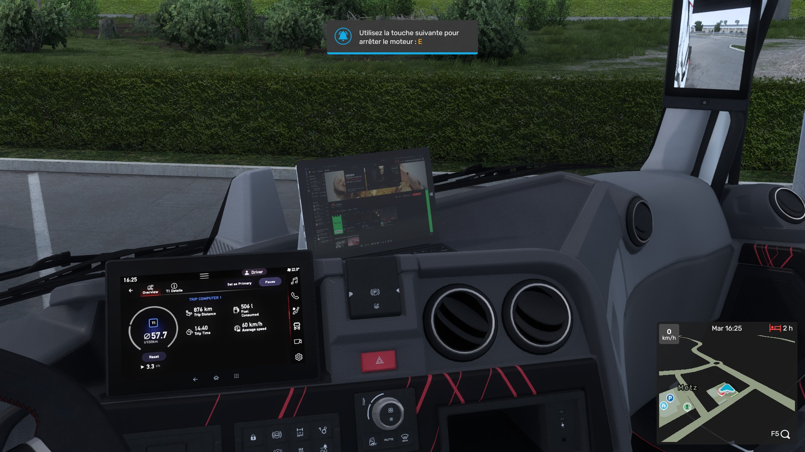
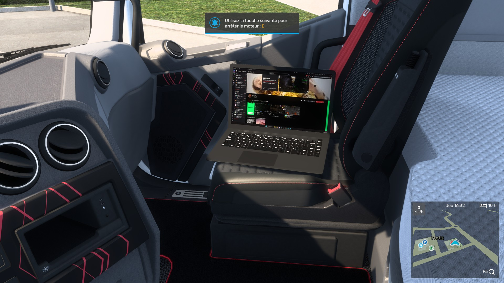

### zBornFat Customization

## Changement
- sideflag
  - normal
  - flip
- largebook
- books
  - book1
  - book2
  - book3
- cans
  - 250ml
  - 330ml
- MSS (Microsoft Surface Pro)
- notebook

## Installation

> [!NOTE]
> Vous devez d'abord posséder les dépendances

1. installer la dernière version du zip [en cliquant ici](https://github.com/zbornfat/ets2/releases/latest)
2. déposer le dossier dans `documents/euro truck simulator 2/mod`
3. dans le jeu, activer le mod __**au dessus**__ de toutes les dépendances

## Modification
1. installer la dernière version sur le repo
2. ouvrir le dossier et modifier les images (faire les fichiers `PNG` et `DDS`) voulu.

si nécessaire vous pouvez convertir en ligne le fichier `.png` en `.dds`

### Tester
pour tester déposer le dossier comme si vous installez le mod mais avec votre dossier modifié.

## Images

|sideflag|Largebook & Books|
|-|-|
|||

|can 220ml|can 330ml|
|-|-|
|||

|MSS|NoteBook|
|-|-|
|||

## Version

Liste des versions testé 

|ETS2|SiSL'S|zBornFat version|Compatibilité|
|-|-|-|-|
|1.58.x|2.5.x|1.1|✅|
|1.58.x|2.5.x|1.2.6|✅|
|1.58.x|2.5.x|1.2.7|✅|
|1.58.x|2.5.x|1.3.3|✅|

## Dépendances

