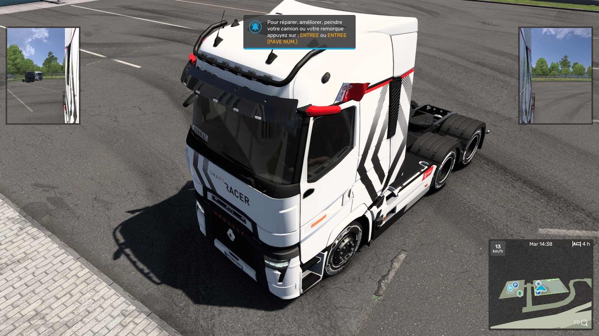
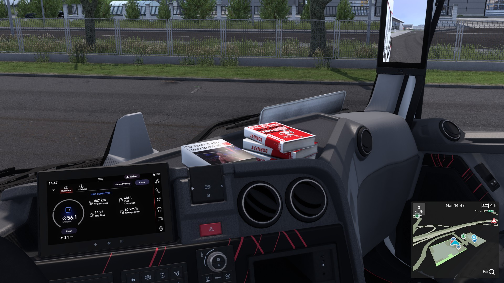

**SiSL's Mod Pack modifié pour BornFat**

## Changement
- flagside
  - normal
  - flip
- largebook
- books
  - book1
  - book2
  - book3
- cans
  - 250ml
  - 330ml

## Installation
1. installer la dernière version sur le repo
2. déposer le dossier dans `documents/euro truck simulator 2/mod`
3. dans le jeu, activer le mod __**au dessus**__ de SiSL's Mod Pack

## Modification
1. installer la dernière version sur le repo
2. ouvrir le dossier et modifier les images (faire les fichiers `PNG` et `DDS`) voulu.

si nécessaire vous pouvez convertir en ligne le fichier `.png` en `.dds`

### Tester
pour tester déposer le dossier comme si vous installez le mod mais avec votre dossier modifié.

## Images

|flagside|Largebook & Books|
|-|-|
|||
