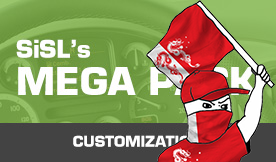
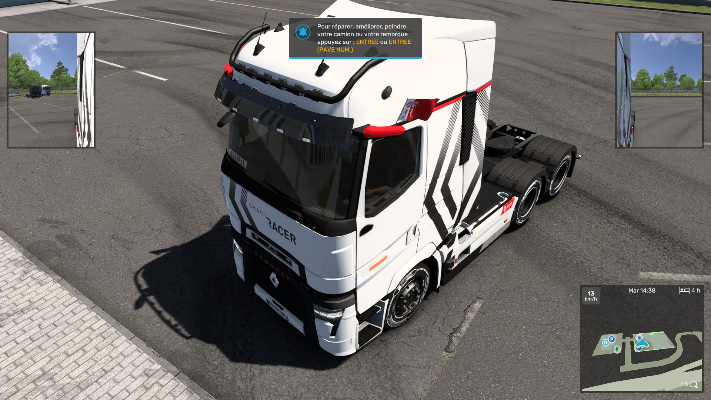
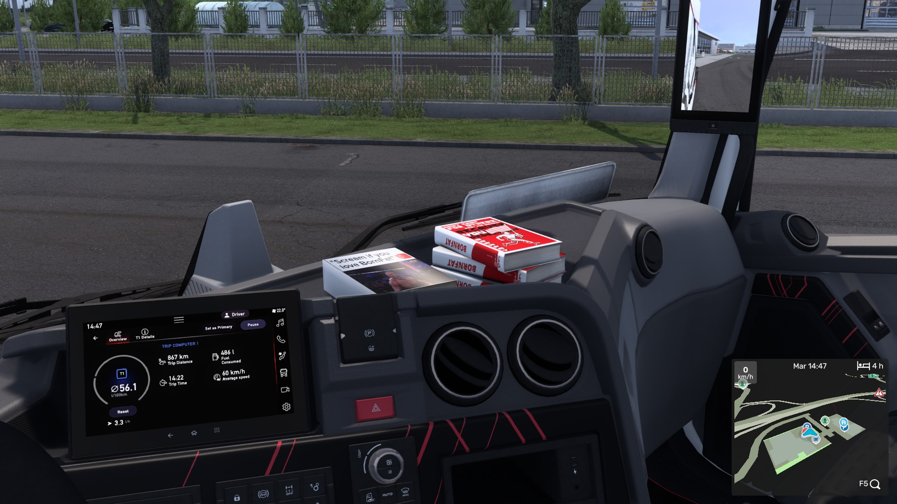
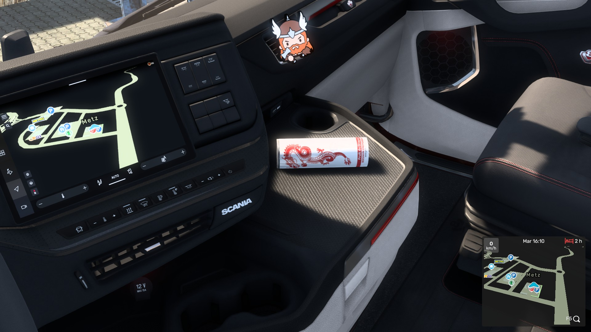
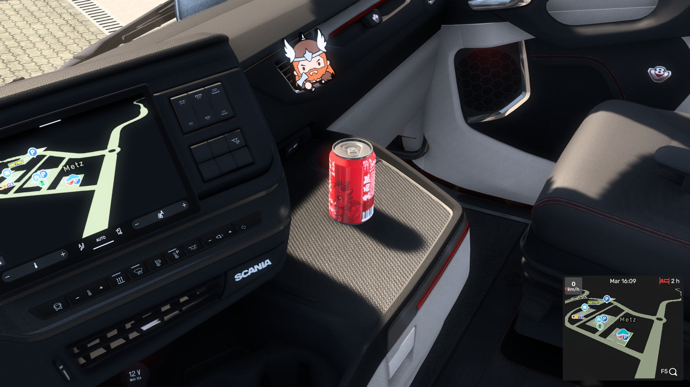
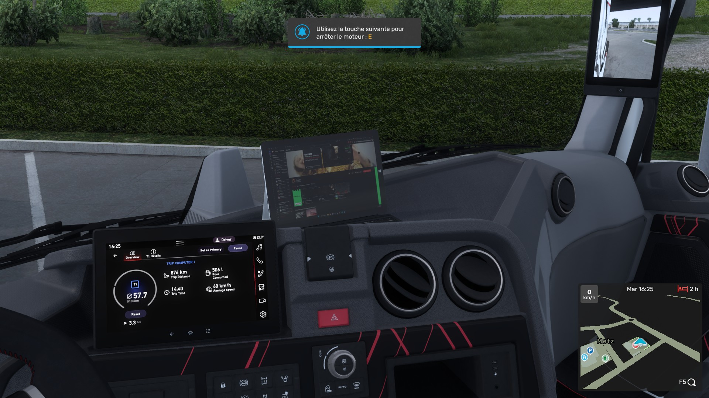
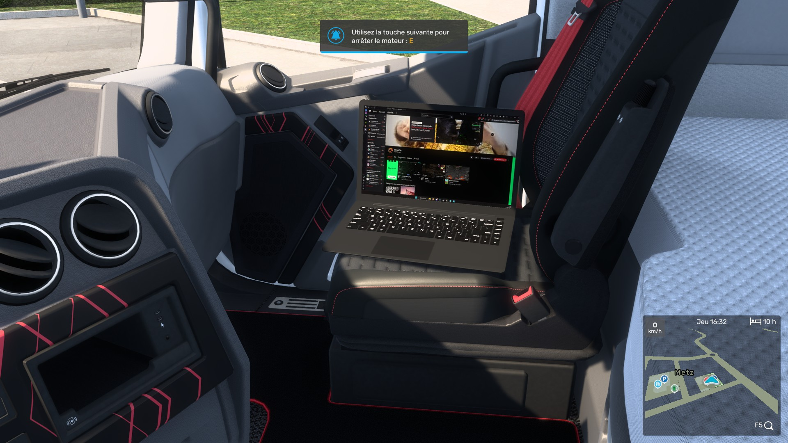
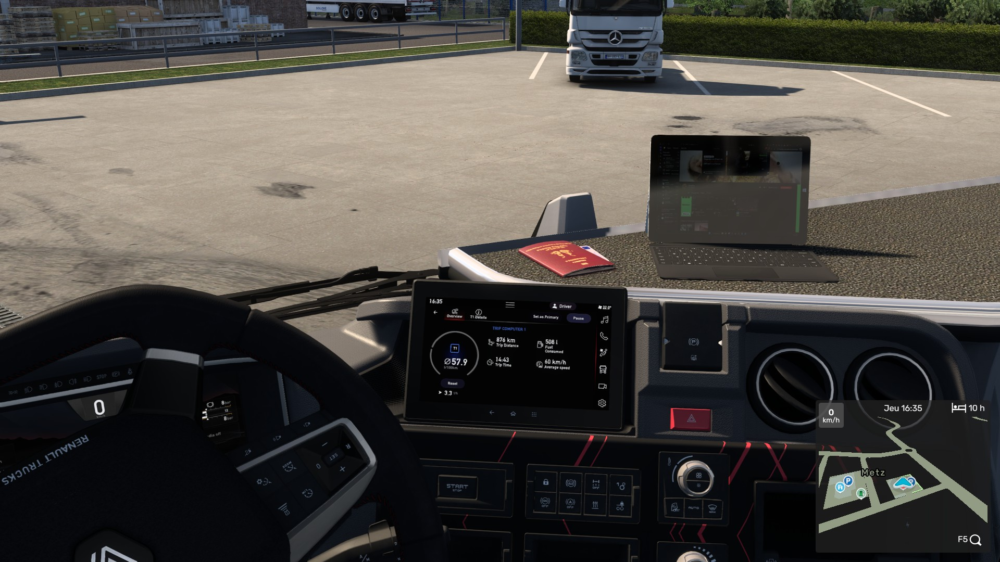
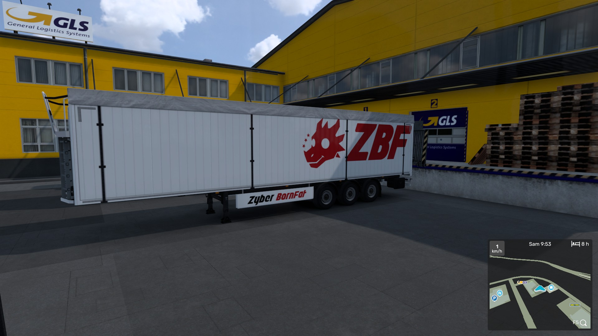

### zBornFat Customization

## Changement

### Customisation

Intérieur

- sideflag
  - normal
  - flip
- largebook
- books
  - book1
  - book2
  - book3
- cans
  - 250ml
  - 330ml
- MSS (Microsoft Surface Pro)
- notebook
- passport

Extérieur

- Lightbox
  - lightbox1
  - lightbox2
  - lightbox3

Entreprise

- eurogoodies (BC)
- posped (ZBF)
- nbfc (CC)
- tradeaux (CM)

## Installation

> [!NOTE]
> Vous devez d'abord posséder les dépendances

1. installer la dernière version du zip [en cliquant ici](https://github.com/zbornfat/ets2/releases/latest) et récupérer le dossier `zBornFat.-.Customization`
2. déposer le dossier dans `documents/euro truck simulator 2/mod`
3. dans le jeu, activer le mod __**au dessus**__ de toutes les dépendances

## Modification
1. installer la dernière version sur le repo
2. ouvrir le dossier et modifier les images (faire les fichiers `PNG` et `DDS`) voulu.

si nécessaire vous pouvez convertir en ligne le fichier `.png` en `.dds`

### Tester
pour tester déposer le dossier comme si vous installez le mod mais avec votre dossier modifié.

## Images

|sideflag|Largebook & Books|
|-|-|
|||

|can 220ml|can 330ml|
|-|-|
|||

|MSS|NoteBook|
|-|-|
|||

|Passport|Remorque|
|-|-|
|||

## Version

Liste des versions testé 

|ETS2|SiSL'S|zBornFat version|Compatibilité|
|-|-|-|-|
|1.58.x|2.5.x|1.1.1..1.8.1|✅|

## Dépendances

### Obligatoire

Liste des dépendances obligatoire pour le bon fonctionnement du mod

### Optionnel

Liste des dépendances optionnelle, non obligatoire pour le bon fonctionnement du mod, mais qui peuvent être nécessaire pour certaines fonctionnalités

### Intégré
Liste des mods déjà installé dans le modpack qui ne sont pas nécessaire à être réinstallé.

N/A

